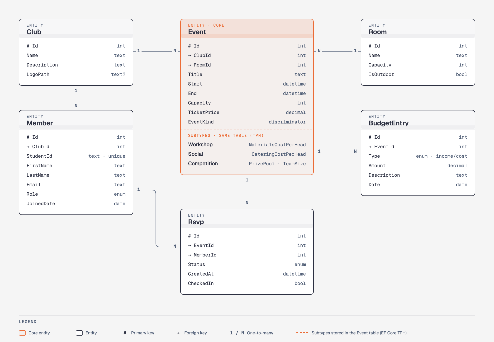

# ClubHub — Uni Club Event Manager — Project Plan

> 31927/32998 .NET Applications Development — Assignment 2 (Group Project)
> Due: **Friday 16 October 2026, 11:59 pm** (team leader submits one zip).
> Plan written: Sunday 4 October 2026.
> Read with: `Assignment2_Specification.md` (marking guide) and `Assignment2_Canvas_Page.md` (report format).

"ClubHub" is a working name — change it if you like.

---

## 1. The idea in one paragraph

University clubs and societies run events (workshops, socials, competitions) using spreadsheets and group chats. RSVPs, waitlists, check-in, clashing room bookings and money are all tracked by hand. ClubHub is a Windows desktop app for club admins that puts all of this in one place. It checks for clashes, runs a waitlist automatically, tracks the budget for each event, and uses machine learning to **predict how many people will actually turn up**, so clubs stop over-ordering food for no-shows.

---

## 2. Tech stack

| Part | Choice | Why |
|---|---|---|
| Framework | .NET 9, Visual Studio 2022 | Required by spec — code must compile in VS 2022 in the lab |
| UI | **WPF** | +2 bonus (instead of Windows Forms) |
| MVVM helper | CommunityToolkit.Mvvm | Less boilerplate for view models and commands |
| Database | **EF Core + SQLite** | Part of the +4 bonus; single `.db` file, nothing to install |
| Machine learning | **ML.NET** (regression) | Part of the +4 bonus — attendance prediction (LLM APIs do **not** count) |
| External API (optional) | Open-Meteo weather (free, no key) | Rain warning for outdoor events |
| Charts | LiveCharts2 (`LiveChartsCore.SkiaSharpView.WPF`) | Dashboard charts |
| Tests | **NUnit** | Required |

> **Windows only:** WPF needs Windows. Anyone on a Mac must build and test on a Windows PC, a lab machine, or a VM (e.g. Parallels). Always check the solution builds in **VS 2022** before pushing — if it does not compile in the demo, we get **zero**.

---

## 3. Solution structure

```
ClubHub.sln
├── ClubHub.Core/        Models, enums, interfaces, services (no UI, no EF code)
│   ├── Models/          Club, Member, Event (+ subclasses), Rsvp, BudgetEntry, Room
│   ├── Enums/           MemberRole, EventType, RsvpStatus, EntryType
│   ├── Interfaces/      IRepository<T>, IClashChecker, IAttendancePredictor, IExporter
│   ├── Services/        ClashChecker, WaitlistService, BudgetService, StatsService
│   └── Extensions/      DateTime / collection extension methods
├── ClubHub.Data/        ClubHubDbContext, Repository<T>, seed data, migrations
├── ClubHub.ML/          AttendancePredictor (ML.NET), training data builder
├── ClubHub.Wpf/         Views (XAML), ViewModels, navigation, App.xaml
└── ClubHub.Tests/       NUnit tests
```

**Rule:** `Core` does not reference `Data`, `ML` or `Wpf`. Everything talks through interfaces. This gives us "high cohesion, low coupling" for the Code Requirement marks.

---

## 4. Data model



*Source: [`diagrams/erd.html`](diagrams/erd.html) (open in a browser). Also exported as [`erd.svg`](diagrams/erd.svg).*

| Class | Key fields |
|---|---|
| `Club` | Id, Name, Description, LogoPath, Members, Events |
| `Member` | Id, StudentId, FirstName, LastName, Email, Role (`MemberRole`), JoinedDate |
| `Room` | Id, Name, Capacity, IsOutdoor |
| `Event` (**abstract**) | Id, ClubId, Title, Start, End, RoomId, Capacity, TicketPrice, Rsvps, BudgetEntries |
| `Workshop : Event` | MaterialsCostPerHead |
| `Social : Event` | CateringCostPerHead |
| `Competition : Event` | PrizePool, TeamSize |
| `Rsvp` | Id, EventId, MemberId, Status (`RsvpStatus`), CreatedAt, CheckedIn |
| `BudgetEntry` | Id, EventId, Type (`EntryType`: Income/Cost), Amount, Description, Date |

Enums: `MemberRole { Member, Treasurer, Secretary, President }`, `EventType { Workshop, Social, Competition }`, `RsvpStatus { Going, Waitlisted, Cancelled }`, `EntryType { Income, Cost }`.

EF Core maps the `Event` subclasses with **TPH** (one table + a discriminator column).

---

## 5. Main functions

The user is a **club admin** (e.g. the club president). Each function has an ID (F1, F2, …) so we can refer to it in the checklist, commits and the report.

### Club and members
- **F1** Admin picks their club. Every screen then shows only that club's data.
- **F2** Admin adds a member: student ID, first name, last name, email, role (member / secretary / treasurer / president).
- **F3** Admin edits a member, or deletes one (the app asks to confirm first).
- **F4** Admin searches members by name, student ID or email, and filters by role.
- **F5** Admin exports the member list to a CSV file.

### Events
- **F6** Admin creates an event and sets: title, type (workshop / social / competition), date, start and end time, room, capacity and ticket price.
  - Workshop also asks for materials cost per person.
  - Social also asks for food cost per person.
  - Competition also asks for prize money and team size.
- **F7** If the room is already booked at that time, the app shows a warning and does not save.
- **F8** The app shows the estimated cost of the event (based on its type).
- **F9** Admin edits or deletes an event.
- **F10** Admin sees all events on a month calendar.

### Registration (RSVP)
- **F11** Admin registers a member for an event.
- **F12** If the event is full, the member goes on the waitlist instead.
- **F13** When a registered member cancels, the first person on the waitlist moves up automatically, and the admin gets a message: *"Emma Patel moved from the waitlist to Going."*
- **F14** If the member is already registered for another event at the same time, the app warns the admin.
- **F15** The app predicts how many people will really come: *"48 registered → about 35 expected."*
- **F16** *(Optional)* For outdoor events, the app shows a rain warning from the weather forecast.

### Event day
- **F17** Admin ticks off each person who arrives (check-in), with a search box to find names fast.
- **F18** The app shows a live count: *"31 of 48 checked in."*
- **F19** Admin exports the attendance list to a CSV file.

### Budget
- **F20** Admin adds income and cost items for an event (e.g. "Pizza — $240").
- **F21** Ticket income is added automatically: people checked in × ticket price.
- **F22** The app shows estimated cost vs actual cost, and the event's profit or loss.

### Dashboard
- **F23** Admin sees key numbers: total members, upcoming events, average attendance rate, no-show rate.
- **F24** Charts: events by type, attendance over time, income vs cost per month.
- **F25** Admin filters the dashboard by date range.

### Messages the admin receives
| When | Message |
|---|---|
| Waitlist moves up (F13) | "Emma Patel moved from the waitlist to Going." |
| Event becomes full (F12) | "Pizza Night is now full. New sign-ups go to the waitlist." |
| Room clash (F7) | "CB11.04.101 is already booked for Intro to Git at that time." |
| Member clash (F14) | "Ben Smith is already registered for Mini Hackathon at that time." |
| Rain forecast (F16, optional) | "Rain is forecast for Pizza Night (outdoor)." |
| Bad input (all forms) | Clear message next to the field, e.g. "End time must be after start time." |

### How it works (developer notes)
- **Clash check (F7, F14):** two time ranges overlap when `a.Start < b.End && b.Start < a.End` — extension method `DateTime.Overlaps(...)`, used by `ClashChecker : IClashChecker`.
- **Estimated cost (F8, F22):** `Event.EstimateCost()` is `abstract`; `Workshop`, `Social`, `Competition` override it (**polymorphism**).
- **Waitlist (F12, F13):** `Going` count < capacity → `Going`, else `Waitlisted`. On cancel, build a `Queue<Rsvp>` ordered by `CreatedAt` and promote the first. `WaitlistService` raises a C# event `MemberPromoted` (delegate) → UI shows the message.
- **Prediction (F15):** ML.NET regression (e.g. FastTree). Features: event type, day of week, start hour, RSVP count, ticket price, is outdoor. Label: actual attendees. Trained on ~300 **synthetic** past events (say so in the report). Behind `IAttendancePredictor`, so tests can use a fake.
- **Weather (F16):** Open-Meteo API (free, no key). No internet → hide the warning, no crash.
- **Export (F5, F19):** `CsvExporter : IExporter<T>`.
- **Dashboard (F23–F25):** `StatsService` using **LINQ with lambdas**, e.g. `events.Where(e => e.End < DateTime.Now).GroupBy(e => e.Type)...`

---

## 6. Screens (rubric: 4+ distinct, resizable, responsive)

| # | Screen | Main job | UI elements |
|---|---|---|---|
| 1 | **Members** | List/search/add/edit club members | DataGrid, search box, dropdown (role), buttons, right-click menu (edit/delete), modal dialog |
| 2 | **Events & Calendar** | Create/edit events, month view, clash warnings | Calendar, date/time pickers, dropdowns (type, room), numeric inputs, warning dialog |
| 3 | **Event Detail & Check-in** | RSVPs, waitlist, check-in, ML prediction | Tabs (Going / Waitlist), checkboxes, progress bar (capacity), image/icon, toast notification |
| 4 | **Budget** | Income/cost entries, estimate vs actual | DataGrid, form inputs, bar chart |
| 5 | **Dashboard** | Club-wide stats | Pie chart, line chart, stat cards, date-range slider |

Navigation: a left side menu in a main window; selecting a club is shared across all screens (counts for "communication between multiple interfaces").

**Responsive rules:** use `Grid` with `*` sizing, no fixed widths/heights on main layouts, set `MinWidth`/`MinHeight` on the window, test at small and maximised sizes.

**UI element categories used (rubric needs 6+):** buttons, data grids, dropdowns, date pickers, calendar, checkboxes, tabs, charts, sliders, context menus, modal dialogs, progress bars, images. ✅

---

## 7. Rubric checklist — where each item lives

| Rubric item | Where | Owner |
|---|---|---|
| Polymorphism | `Event.EstimateCost()` overridden in `Workshop`/`Social`/`Competition`; constructor overloads on `Member` | A |
| 2+ interfaces | `IRepository<T>`, `IClashChecker`, `IAttendancePredictor`, `IExporter` | A, B, C |
| NUnit tests | `ClubHub.Tests` — clash, waitlist, budget, stats | A (+ everyone tests own service) |
| Anonymous method / LINQ + lambda | `StatsService`, search filters | C |
| Generics / generic collections | `IRepository<T>`, `Repository<T>`, `Queue<Rsvp>`, `Dictionary<EventType, …>` | A, B |
| Enums, properties, extension methods | `Enums/`, `Extensions/` | A |
| Delegates / events | `WaitlistService.MemberPromoted` | B |
| File/database read & write, EF | EF Core SQLite + CSV export | A |
| Error handling | try/catch around DB, ML and API calls; friendly error dialogs | everyone |
| Input validation | required fields, email format, end > start, capacity > 0, amounts > 0 | everyone |
| Code quality | consistent formatting, short helpful comments, clear names | everyone |
| Bonus: WPF (+2) | `ClubHub.Wpf` | — |
| Bonus: EF + ML.NET / API (+4) | `ClubHub.Data`, `ClubHub.ML`, weather | A, C |

---

## 8. Team split (team of 3 — adjust if 2)

| Member | Name | Main area | Screens |
|---|---|---|---|
| **A** | _fill in_ | Solution setup, Core models/enums/interfaces, EF Core + seed data, repositories, NUnit test project, CSV export | Members |
| **B** | _fill in_ | Events, clash checking, RSVP + waitlist, check-in, main window + navigation | Events & Calendar, Event Detail |
| **C** | _fill in_ | Budget, stats (LINQ), charts, ML.NET prediction, weather API (optional) | Budget, Dashboard |

**Team of 2:** A takes A + half of C (budget); B takes B + the other half of C (dashboard, ML). Drop the weather API.

Each person: builds their own screens, writes NUnit tests for their own services, writes their own paragraph in "Role of team members" in the report.

---

## 9. Timeline

| Dates | Phase | Goal |
|---|---|---|
| **Sun 4 – Mon 5 Oct** | 0. Setup | Agree plan + roles. Submit registration form. Check idea with tutor at next lab. A creates repo + solution skeleton + all models/interfaces so B and C can start. |
| **Tue 6 – Thu 8 Oct** | 1. Foundations | DbContext, migrations, seed data (incl. ~300 synthetic past events). Each screen built with real data binding. Main window navigation working. |
| **Fri 9 – Mon 12 Oct** | 2. Features | Clash check, waitlist, check-in, budget, dashboard charts, ML model trained and shown. NUnit tests written alongside. |
| **Tue 13 Oct** | 3. Integration | Merge everything, fix bugs, validation + error handling pass, resizing check on every screen. **Feature freeze at end of day.** |
| **Wed 14 Oct** | 4. Polish + report | Bug fixes only. Draft report, take screenshots, draw flowchart, write README. |
| **Thu 15 Oct** | 5. Pack + test | Final report PDF. Build zip, unzip on a **clean Windows machine**, open in VS 2022, build, run, run tests. |
| **Fri 16 Oct** | 6. Submit | Team leader submits by **midday** (deadline 11:59 pm). Download the submission from Canvas and test it again. |

The demo is in our lab session — check the date with the tutor and practise the demo once before.

---

## 10. Working together

- **Git:** one GitHub repo. `main` must always build. Each person works on a feature branch (`feature/waitlist`, `feature/dashboard`, …) and merges by pull request; someone else glances at it before merging.
- **Never** commit `bin/`, `obj/`, `.vs/` (use the standard VS `.gitignore`). Commit the seed logic and migrations, **not** the `.db` file — the app creates and seeds it on first run.
- **Commit messages:** short, what changed (e.g. `add waitlist promotion`).
- **Naming:** PascalCase for classes/methods/properties, `_camelCase` for private fields, interfaces start with `I`. One class per file.
- **Comments:** short, only where the *why* is not obvious. XML doc comments (`///`) on public service methods.
- **Check-ins:** quick message in the group chat every day: done / doing / blocked.

---

## 11. Report plan (PDF, 1500–2000 words, 4 marks)

Follows the Canvas report format:

| Section | Min words | Writer |
|---|---|---|
| 1. Introduction and Summary (purpose, motivation, key features) | 250 | A |
| 2. Development approach (WPF, MVVM, EF Core, ML.NET, NUnit, Git; usage instructions summary) | — | B |
| 3. Flowchart (how screens, services, data and ML connect) | — | C |
| 4. Role of team members (each person's paragraph + summary table) | 500 | everyone |
| 5. Acknowledgments (incl. how AI tools were used, if used) | — | A |
| 6. References (APA 7th — libraries, Open-Meteo, any tutorials) | — | everyone adds as they go |

Keep a running list of every library, tutorial and AI tool used — we need it for sections 5 and 6.

---

## 12. Zip contents (final submission)

```
ClubHub_Group<N>.zip
├── ClubHub.sln + all project folders (source only, no bin/obj)
├── Report.pdf
└── README.txt   — how to open, build, run, run tests; test login/data notes; team members
```

---

## 13. Open decisions (agree at first meeting)

- [ ] Team size, names, and who is A / B / C
- [ ] Team leader (submits on Canvas, registered on the form)
- [ ] Final app name
- [ ] Weather API in or out (decide by Mon 12 Oct based on progress)
- [ ] Who has a Windows machine for builds; when we meet to merge on Tue 13 Oct
